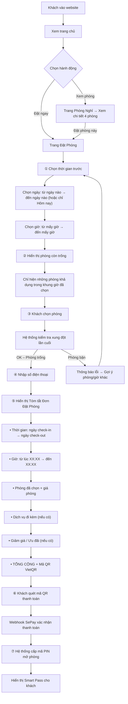
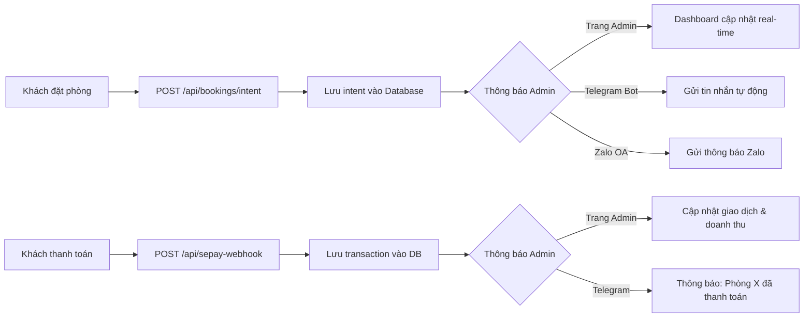
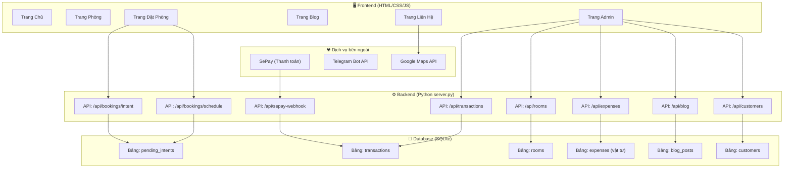

# BƯỚC 2 – PLAN CHIẾN LƯỢC TỔNG THỂ
## Website Nhà Nghỉ Diễm Châu

> **SEO Title:** Nhà Nghỉ Diễm Châu – Giá rẻ, phòng sạch, kín đáo  
> **Slogan:** Riêng Tư Tuyệt Đối  
> **Đối tượng:** 25–35 tuổi, Mobile-first, người Việt  
> **Ngôn ngữ:** Tiếng Việt (mặc định) + Tiếng Anh  
> **Stack:** HTML/CSS/JS (TailwindCSS) + Python Backend

---

## PHẦN 1: PLAN CHIẾN LƯỢC TỔNG THỂ CÁC TÍNH NĂNG

### 1.1 Bảng phân loại tính năng: Khách hàng (User) vs Quản trị viên (Admin)

#### 🟢 TÍNH NĂNG DÀNH CHO KHÁCH HÀNG (User-Facing)

| # | Tính năng | Mô tả | Giai đoạn |
|---|-----------|-------|-----------|
| U1 | **Trang chủ (Home)** | Hero banner, giới thiệu ngắn, highlight phòng, CTA đặt phòng | MVP |
| U2 | **Xem phòng & Chọn phòng** | Xem 4 phòng (101–104), ảnh, mô tả, giá, trạng thái trống/đang có khách | MVP |
| U3 | **Đặt phòng theo thời gian** | Chọn phòng → chọn ngày/giờ check-in & check-out → tính giá tự động | MVP |
| U4 | **Thanh toán VietQR** | Tạo mã QR VietQR với memo tự động, khách quét thanh toán | MVP |
| U5 | **Nhận mã mở khóa phòng (Smart Pass)** | Sau khi thanh toán thành công → hệ thống cấp mã PIN mở phòng | MVP |
| U6 | **Xem vị trí trên Google Maps** | Bản đồ Google Maps nhúng trực tiếp, hiển thị vị trí nhà nghỉ | MVP |
| U7 | **Chuyển đổi ngôn ngữ VN/EN** | Nút toggle ngôn ngữ, mặc định tiếng Việt | MVP |
| U8 | **Blog / Trải nghiệm** | Bài viết chia sẻ mẹo du lịch, trải nghiệm khách hàng (SEO) | MVP |
| U9 | **Liên hệ** | Form liên hệ, số điện thoại, Zalo, mạng xã hội | MVP |
| U10 | **Đánh giá khách hàng (Testimonials)** | Hiển thị nhận xét của khách đã ở | Nâng cao |
| U11 | **Gallery ảnh** | Bộ sưu tập ảnh phòng, không gian xung quanh | Nâng cao |

#### 🔵 TÍNH NĂNG DÀNH CHO QUẢN TRỊ VIÊN (Admin)

| # | Tính năng | Mô tả | Giai đoạn |
|---|-----------|-------|-----------|
| A1 | **Dashboard tổng quan** | Hiển thị doanh thu hôm nay, tuần, tháng; số phòng trống; số đơn đặt | MVP |
| A2 | **Quản lý phòng** | Xem trạng thái 4 phòng (trống/có khách/đang dọn), khóa/mở phòng thủ công | MVP |
| A3 | **Quản lý mã phòng (PIN)** | Cấp, xem, reset mã PIN mở khóa cho từng phòng | MVP |
| A4 | **Lịch sử giao dịch** | Danh sách giao dịch chi tiết: khách hàng, SĐT, phòng, thời gian check-in/out, số tiền | MVP |
| A5 | **Lưu trữ thông tin khách hàng** | Lưu SĐT, tên, lịch sử đặt phòng của khách | MVP |
| A6 | **Thống kê doanh thu** | Biểu đồ doanh thu theo ngày/tuần/tháng/năm | MVP |
| A7 | **Quản lý chi phí vật tư** | Nhập/theo dõi chi phí các sản phẩm đi kèm | MVP |
| A8 | **Chi phí phát sinh** | Thêm các khoản chi phí phát sinh ngoài vật tư | MVP |
| A9 | **Quản lý blog** | Thêm/sửa/xóa bài viết blog | Nâng cao |
| A10 | **Thông báo đặt phòng** | Nhận thông báo real-time khi có khách đặt phòng mới (Telegram/Zalo) | Nâng cao |

### 1.2 Danh mục Vật tư & Sản phẩm đi kèm (cho tính năng A7)

| STT | Sản phẩm | Đơn vị |
|-----|----------|--------|
| 1 | Dầu gội | Chai |
| 2 | Sữa tắm | Chai |
| 3 | Nước suối | Chai |
| 4 | Trà xanh (nước giải khát) | Chai |
| 5 | Number One (nước giải khát) | Chai |
| 6 | Red Bull (nước giải khát) | Chai |
| 7 | Bàn chải đánh răng | Cái |
| 8 | Bột giặt | Gói |
| 9 | Nước xả vải | Chai |
| 10 | *(Thêm chi phí phát sinh khác)* | Tùy chọn |

---

## PHẦN 2: SƠ ĐỒ CẤU TRÚC TRANG (SITEMAP)

### 2.1 Cây trang chính (Multi-tab Navigation)

```
🏠 DIỄM CHÂU WEBSITE
│
├── 📄 TRANG CHỦ (Home) ─────────────── /index.html
│   ├── Hero Banner + CTA "Đặt Phòng Ngay"
│   ├── Thanh đặt phòng nhanh (Check-in / Check-out / Phòng)
│   ├── Điểm nổi bật (Giá rẻ, Sạch sẽ, Kín đáo, Riêng tư)
│   ├── Preview 4 phòng
│   └── Testimonials (đánh giá khách)
│
├── 🛏️ PHÒNG NGHỈ (Rooms) ──────────── /rooms.html
│   ├── Danh sách 4 phòng (101, 102, 103, 104)
│   ├── Chi tiết từng phòng (ảnh, mô tả, tiện nghi, giá)
│   └── Nút "Đặt phòng này"
│
├── 📅 ĐẶT PHÒNG (Booking) ─────────── /booking.html
│   ├── Chọn phòng
│   ├── Chọn ngày & giờ (check-in / check-out)
│   ├── Timeline hiển thị (check-in → check-out → dọn phòng)
│   ├── Kiểm tra xung đột (phòng đang bận)
│   ├── Nhập số điện thoại
│   ├── Modal QR VietQR thanh toán
│   └── Smart Pass (mã mở khóa phòng)
│
├── 📝 BLOG ─────────────────────────── /blog.html
│   ├── Danh sách bài viết (mẹo du lịch, trải nghiệm)
│   └── Trang chi tiết bài viết (/blog-detail.html?id=...)
│
├── 📍 LIÊN HỆ (Contact) ───────────── /contact.html
│   ├── Thông tin liên hệ (SĐT, Zalo, email)
│   ├── Google Maps nhúng trực tiếp
│   ├── Form gửi tin nhắn
│   └── Mạng xã hội (Facebook, Zalo, TikTok)
│
├── ℹ️ GIỚI THIỆU (About) ──────────── /about.html
│   ├── Câu chuyện Diễm Châu
│   ├── Gallery ảnh không gian
│   └── Giá trị cốt lõi
│
└── 🔒 QUẢN TRỊ (Admin) ────────────── /admin.html (ẩn, bảo vệ PIN)
    ├── Tab: Dashboard tổng quan
    │   ├── Doanh thu hôm nay / tuần / tháng
    │   ├── Số phòng trống / đang sử dụng
    │   └── Tổng đơn đặt hôm nay
    ├── Tab: Quản lý phòng
    │   ├── Trạng thái 4 phòng (real-time)
    │   ├── Mã PIN từng phòng
    │   └── Khóa/Mở phòng thủ công
    ├── Tab: Lịch sử giao dịch
    │   ├── Bảng giao dịch (SĐT, phòng, thời gian, số tiền)
    │   └── Tìm kiếm / lọc theo ngày
    ├── Tab: Thông tin khách hàng
    │   ├── Danh sách khách (SĐT, tên, lịch sử đặt)
    │   └── Tìm kiếm khách
    ├── Tab: Thống kê doanh thu
    │   ├── Biểu đồ doanh thu (ngày/tuần/tháng)
    │   └── Tổng thu – Tổng chi = Lợi nhuận
    ├── Tab: Quản lý chi phí vật tư
    │   ├── Bảng vật tư (tên, số lượng, đơn giá, tổng chi)
    │   ├── Thêm / sửa / xóa vật tư
    │   └── Chi phí phát sinh khác
    └── Tab: Quản lý Blog
        ├── Danh sách bài viết
        └── Thêm / sửa / xóa bài viết
```

### 2.2 Thanh Navigation chính (Multi-tab)

```
┌──────────────────────────────────────────────────────────────────────┐
│ [LOGO]  Trang Chủ | Phòng Nghỉ | Đặt Phòng | Blog | Liên Hệ | 🌐 VN/EN │  [ĐẶT NGAY] │
└──────────────────────────────────────────────────────────────────────┘
```

- **Logo** Diễm Châu (ảnh đã cung cấp) ở bên trái
- **Nút "Đặt Ngay"** nổi bật ở bên phải (màu accent)
- **Nút VN/EN** chuyển đổi ngôn ngữ
- **Menu hamburger** trên mobile

---

## PHẦN 3: FLOW CÁC LUỒNG THÔNG TIN & TƯƠNG TÁC

### 3.1 Luồng đặt phòng của Khách hàng (User Booking Flow)



**Tóm tắt thứ tự luồng đặt phòng (7 bước):**

| Bước | Hành động | Mô tả |
|------|-----------|-------|
| ① | **Chọn thời gian** | Ngày mấy → ngày mấy, mấy giờ → mấy giờ (hoặc "Hôm nay") |
| ② | **Hiện phòng trống** | Chỉ hiển thị phòng khả dụng trong khung giờ đã chọn |
| ③ | **Chọn phòng & Kiểm tra xung đột** | Khách chọn phòng, hệ thống xác nhận lần cuối |
| ④ | **Nhập số điện thoại** | SĐT liên lạc của khách |
| ⑤ | **Tóm tắt đơn đặt phòng** | Hiển thị đầy đủ: ngày, giờ, phòng, dịch vụ, giảm giá, tổng tiền + mã QR |
| ⑥ | **Thanh toán** | Khách quét QR VietQR → SePay xác nhận |
| ⑦ | **Smart Pass** | Cấp mã PIN mở khóa phòng |

### 3.2 Luồng thông tin bắn về Quản trị viên (Admin Notification Flow)



### 3.3 Luồng dữ liệu tổng thể (Data Flow)



### 3.4 Luồng quản lý chi phí vật tư (Expense Flow)

```
Admin → Tab "Chi phí vật tư" → Thêm sản phẩm (tên, số lượng, đơn giá)
                              → Hệ thống tính tổng chi
                              → Hiển thị: Tổng Doanh Thu – Tổng Chi Phí = Lợi Nhuận Ròng
                              → Thêm chi phí phát sinh (mô tả tùy chỉnh + số tiền)
```

### 3.5 Luồng Blog / SEO

```
Admin → Tab "Blog" → Viết bài mới (tiêu đề, nội dung, ảnh, tags)
                    → Lưu vào DB
                    → Hiển thị trên /blog.html
                    → Google index bài viết (SEO meta tags, schema.org)
                    → Khách tìm "nhà nghỉ giá rẻ" trên Google → Thấy bài viết → Vào website
```

---

## TÓM TẮT KẾ HOẠCH

| Hạng mục | Chi tiết |
|----------|----------|
| **Tổng số trang** | 7 trang (Home, Rooms, Booking, Blog, Blog Detail, Contact, About) + 1 trang Admin |
| **Tính năng User (MVP)** | 9 tính năng |
| **Tính năng Admin (MVP)** | 8 tính năng |
| **Tính năng nâng cao** | 4 tính năng (Testimonials, Gallery, Quản lý Blog, Thông báo Telegram/Zalo) |
| **API endpoints** | 8 endpoints |
| **Database tables** | 6 bảng |
| **Dịch vụ bên ngoài** | SePay, Telegram Bot, Google Maps |
| **Ngôn ngữ** | VN (mặc định) + EN |
| **SEO** | Meta tags, OG tags, JSON-LD schema, Blog |

---

> ⚠️ **CHỜ DUYỆT:** Xin anh xem qua toàn bộ plan chiến lược này.
> - Nếu đồng ý → Phản hồi **"Duyệt"** để em chuyển sang **Bước 3 (Spec UI/UX chi tiết)**.
> - Nếu cần chỉnh sửa → Cho em biết phần nào cần thay đổi, em sẽ cập nhật lại.
